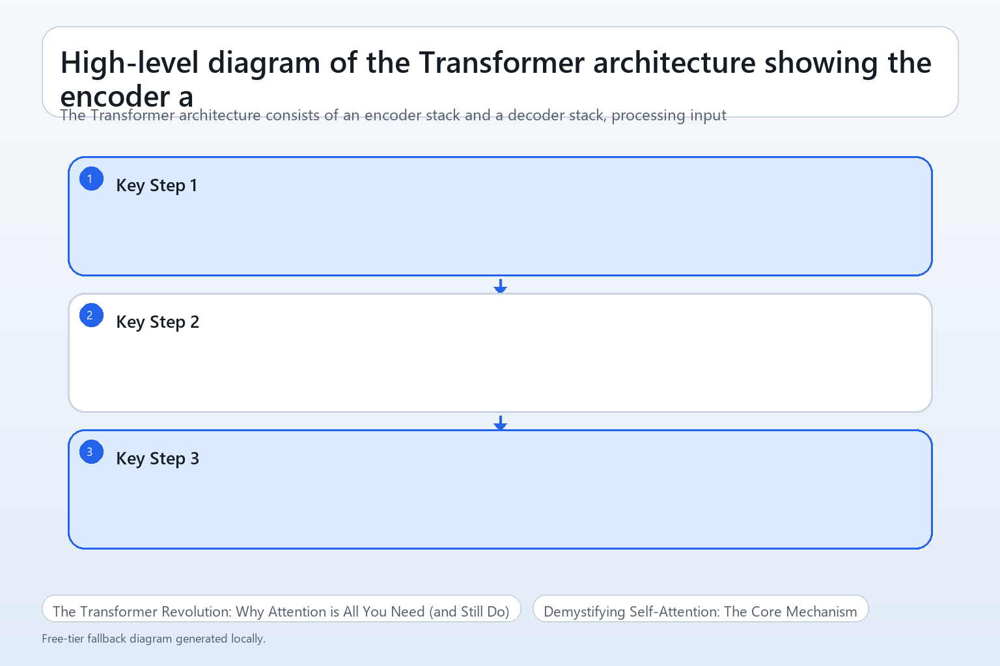
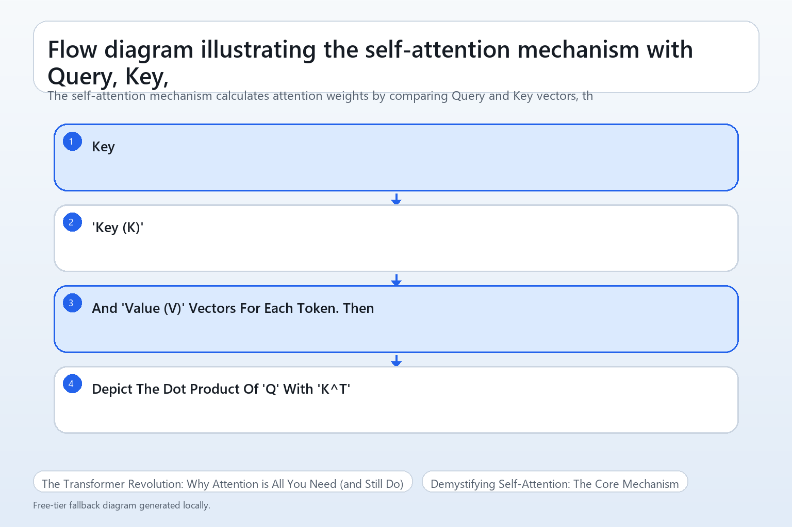
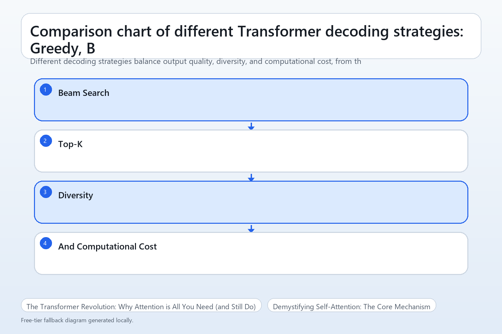

# Inside a Transformer: From Attention to Output Tokens

## The Transformer Revolution: Why Attention is All You Need (and Still Do)

Before the Transformer, sequence modeling was dominated by Recurrent Neural Networks (RNNs) and their variants like Long Short-Term Memory (LSTMs). While effective for tasks like machine translation, these architectures processed data sequentially, token by token. This inherent sequentiality created a bottleneck for parallel computation and struggled with capturing long-range dependencies, as information had to propagate through many steps, often leading to vanishing or exploding gradients.

The landscape dramatically shifted with the 2017 paper "Attention Is All You Need." This seminal work introduced the Transformer architecture, which entirely abandoned recurrence in favor of a mechanism called self-attention. Self-attention allows every token in a sequence to directly interact with every other token, weighing their relevance. This parallel processing capability revolutionized training speed and significantly improved the model's ability to capture complex, long-range relationships within data.

The Transformer's paradigm shift quickly led to its widespread adoption and evolution across various domains. In Natural Language Processing (NLP), models like BERT and GPT demonstrated unprecedented capabilities in understanding and generating human language ([Source](https://arxiv.org/abs/2503.20227)). Its versatility extended beyond text, with the Vision Transformer (ViT) adapting the architecture for image processing, achieving state-of-the-art results in computer vision tasks ([Source](https://d2l.ai/chapter_attention-mechanisms-and-transformers/vision-transformer.html)). Multimodal Transformers further integrated different data types, such as text and images ([Source](https://www.newline.co/@Dipen/top-10-new-ai-models-to-explore-in-2026--b4ca6fcf)).

As of 2026, the Transformer remains the foundational architecture for most state-of-the-art AI models. While research continues into alternatives like State Space Models (SSMs) and Mixture of Experts (MoE) to address specific limitations such as computational cost or latency (Source), Transformers are not being replaced but rather refined and integrated. Hybrid models, combining Transformers with other techniques like XGBoost, are also emerging to leverage their respective strengths ([Source](https://www.nature.com/articles/s41598-024-81456-1)). This ongoing evolution underscores the enduring relevance of the attention mechanism.


*The Transformer architecture consists of an encoder stack and a decoder stack, processing input and generating output sequences respectively, connected by cross-attention.*

## Demystifying Self-Attention: The Core Mechanism

Self-attention is the foundational mechanism that allows Transformers to weigh the importance of different tokens in an input sequence when processing a single token. Unlike traditional recurrent neural networks that process tokens sequentially, self-attention enables parallel processing and captures long-range dependencies effectively. This is achieved through a clever interplay of Query, Key, and Value vectors.

At its heart, self-attention operates using three distinct vector representations for each token in the input sequence: the Query (Q), Key (K), and Value (V) vectors. Imagine a library:
*   The **Query (Q)** vector represents what the current token is "looking for" or its "question" about other tokens.
*   The **Key (K)** vector represents what each other token "offers" or its "index card" describing its content.
*   The **Value (V)** vector represents the actual information content of each other token, like the "book itself" that will be retrieved and combined.
These Q, K, and V vectors are derived from the initial embedding of each token through learned linear transformations, allowing the model to project the token's meaning into different spaces for comparison and information extraction.


*The self-attention mechanism calculates attention weights by comparing Query and Key vectors, then uses these weights to create a weighted sum of Value vectors, producing a context-aware output.*

The calculation of self-attention for a given token follows a specific formula: `softmax(Q * K^T / sqrt(d_k)) * V`. Let's break this down step-by-step:
1.  **`Q * K^T`**: The Query vector of the current token is multiplied by the transpose of the Key matrix (containing all Key vectors in the sequence). This dot product calculates a raw similarity score between the current token's query and every other token's key. A higher score indicates greater relevance.
2.  **`/ sqrt(d_k)`**: The raw scores are then divided by the square root of the dimension of the Key vectors (`d_k`). This scaling factor is crucial for stabilizing training, preventing the dot products from becoming too large and pushing the softmax function into regions with extremely small gradients.
3.  **`softmax(...)`**: The scaled scores are passed through a softmax function. This normalizes the scores into a probability distribution, ensuring they sum to 1. These normalized scores are the attention weights, indicating how much attention the current token should pay to each other token.
4.  **`... * V`**: Finally, these attention weights are multiplied by the Value matrix (containing all Value vectors). This creates a weighted sum of the Value vectors, where tokens with higher attention weights contribute more of their information to the output representation of the current token. The result is a new, context-aware vector for the current token.

Consider the sentence, "The animal didn't cross the street because it was too tired." If we are computing the self-attention for the token "it", its Query vector will interact with the Key vectors of all other tokens. The dot product `Q_it * K_animal^T` would likely yield a high score, as would `Q_it * K_tired^T`. After scaling and softmax, "animal" and "tired" would receive high attention weights. The resulting output vector for "it" would then be a weighted sum of the Value vectors of "animal", "tired", and other words, effectively encoding the context that "it" refers to the "animal" and its state of being "tired."

The benefits of self-attention are profound. It can capture **long-range dependencies** within a sequence, meaning a token can directly attend to any other token, regardless of its position, which is a significant advantage over recurrent models. Furthermore, self-attention is highly **parallelizable** because the attention scores for all tokens can be computed simultaneously, leading to much faster training times. Lastly, it provides **dynamic weighting**, allowing each token to dynamically determine the relevance of all other tokens, leading to rich, context-aware representations that adapt to the specific input.

## Enhancing Attention: Multi-Head and Positional Encoding

The core self-attention mechanism is powerful, but Transformers introduce two crucial enhancements: Multi-Head Attention and Positional Encoding, which significantly boost the model's ability to process sequential data effectively.

Multi-Head Attention allows the model to jointly attend to information from different representation subspaces at different positions. Instead of performing a single attention function with one set of Query (Q), Key (K), and Value (V) matrices, Multi-Head Attention splits these into multiple "heads." Each head independently projects the input embeddings into lower-dimensional Q, K, and V spaces, then computes its own scaled dot-product attention. This enables the model to capture diverse relationships concurrently, such as syntactic dependencies in one head and semantic similarities in another.

Once each attention head computes its output, these individual outputs, each representing a different "aspect" of attention, are concatenated. This combined, higher-dimensional representation is then passed through a final linear transformation. This linear layer projects the concatenated output back to the expected dimension of the model, allowing the various learned attention patterns to be integrated and passed to subsequent layers in a consistent format.

Crucially, the self-attention mechanism itself is permutation-invariant; it processes tokens as a set, inherently losing information about their order. To address this, Positional Encoding is introduced. This technique injects information about the relative or absolute position of tokens within the sequence directly into the input embeddings. Without it, "dog bites man" would be indistinguishable from "man bites dog" in terms of token order.

A common approach for Positional Encoding uses fixed sinusoidal functions. These functions generate unique vectors for each position, which are then element-wise added to the corresponding token embeddings. This simple addition creates "position-aware" embeddings that retain both the semantic meaning of the token and its sequential context, allowing the Transformer to leverage the critical order information for tasks like language understanding.

## The Encoder Stack: Processing Input Context

The Transformer encoder stack is responsible for processing the input sequence and generating a rich contextualized representation for each token. It achieves this by stacking multiple identical encoder blocks, each refining the representations passed from the previous layer. A single encoder block is a powerful unit comprising several key components: Multi-Head Self-Attention, Layer Normalization, Residual Connections, and a Position-wise Feed-Forward Network.

Layer Normalization and Residual Connections are crucial architectural elements that enhance the stability and training of deep networks. Layer Normalization operates across the features of each token independently, normalizing the activations within each layer. This helps stabilize training by preventing internal covariate shift, where the distribution of layer inputs changes during training, making it harder for subsequent layers to learn. Residual Connections, on the other hand, involve adding the input of a sub-layer directly to its output. This "skip connection" allows gradients to flow more easily through the network during backpropagation, effectively mitigating the vanishing gradient problem and enabling the training of much deeper models.

Following the attention mechanism and its normalization, the data flows into a Position-wise Feed-Forward Network (FFN). This FFN is a simple, fully connected neural network applied independently and identically to each position in the sequence. It typically consists of two linear transformations with a ReLU activation in between. Its primary role is to introduce non-linearity and allow the model to learn complex, position-specific transformations on the attention-weighted representations, enriching the feature space.

Tracing the flow of information through a single encoder block, an input embedding first enters the Multi-Head Self-Attention sub-layer. Here, it interacts with all other tokens in the sequence to compute context-aware representations. The output of this attention sub-layer is then passed through a Layer Normalization layer, and its original input is added back via a Residual Connection. This normalized, residual output then proceeds to the Position-wise Feed-Forward Network, where each token's representation is independently transformed. Finally, the FFN's output undergoes another Layer Normalization and Residual Connection before exiting the block, ready to be passed to the next encoder layer or, if it's the last block, to the decoder.

## The Decoder Stack: Generating Output Tokens

The Transformer's decoder stack is responsible for generating the output sequence, token by token, based on the context provided by the encoder and the tokens it has already produced. Unlike the encoder, which processes the entire input sequence in parallel, the decoder operates in an autoregressive manner, predicting one token at a time and feeding its own output back as input for the next prediction.

Each decoder block is composed of three main sub-layers:
1.  **Masked Multi-Head Self-Attention**: Allows the decoder to attend to previously generated tokens in the output sequence.
2.  **Multi-Head Cross-Attention (Encoder-Decoder Attention)**: Enables the decoder to focus on relevant parts of the input sequence processed by the encoder.
3.  **Position-wise Feed-Forward Network**: A standard fully connected feed-forward network applied independently to each position.

The **Masked Multi-Head Self-Attention** sub-layer is crucial for the decoder's autoregressive nature. Here, the Queries (Q), Keys (K), and Values (V) are all derived from the decoder's own previous layer output. The "masked" aspect refers to a causal masking mechanism applied during training. This mask prevents each position from attending to subsequent positions in the output sequence. In practice, this means that when predicting the *n*-th token, the attention mechanism can only see tokens 1 through *n*-1, effectively simulating the real-world generation process where future tokens are unknown. Without this masking, the decoder could "cheat" by looking ahead, undermining its ability to learn sequential dependencies.

Following the masked self-attention, the **Multi-Head Cross-Attention** sub-layer acts as a bridge between the encoder and decoder. In this attention mechanism, the Queries (Q) are generated from the output of the decoder's masked self-attention sub-layer. However, the Keys (K) and Values (V) come directly from the final output of the encoder stack. This setup allows the decoder to selectively focus on different parts of the input sequence, as encoded by the Transformer's encoder, to inform its current token prediction. This is vital for tasks like machine translation, where the output needs to align semantically with the input.

Finally, the output from the cross-attention layer passes through a **Position-wise Feed-Forward Network**. This network applies a series of linear transformations and non-linear activations independently to each position, further processing the information before it moves to the next decoder block or the final output layer.

The entire process of token generation is sequential. The decoder starts with a special `<SOS>` (Start Of Sequence) token. It then iteratively predicts the next token based on the `<SOS>` token and the encoder's output. This newly predicted token is then appended to the sequence and fed back into the decoder as input for the next step. This continues until an `<EOS>` (End Of Sequence) token is generated, or a maximum sequence length is reached. Each new token's prediction leverages both the context of previously generated tokens (via masked self-attention) and the comprehensive understanding of the input sequence provided by the encoder (via cross-attention).

## Decoding Strategies: From Logits to Coherent Text

After the Transformer decoder processes its input and attention mechanisms, its final output is not yet human-readable text. Instead, it produces a vector of raw scores, known as **logits**, for each potential next token in the vocabulary. This vector's dimension matches the size of the model's vocabulary. To convert these raw scores into a meaningful probability distribution, a final linear layer maps the decoder's hidden state to the vocabulary size, and then the **softmax activation function** is applied. Softmax transforms these logits into a probability distribution where each value is between 0 and 1, and all probabilities sum to 1, indicating the model's confidence for each possible next token.

To illustrate this, consider a minimal example of how logits are converted to probabilities and how a simple decoding strategy selects the next token.

```python
import numpy as np

# Example: Raw logits output from the decoder for a vocabulary of 5 tokens
# (e.g., representing probabilities for "the", "a", "cat", "dog", "runs")
logits = np.array([1.2, 0.5, 2.1, 0.8, 1.5])

# Apply softmax to convert logits into a probability distribution
probabilities = np.exp(logits) / np.sum(np.exp(logits))
print(f"Token Probabilities: {probabilities}")

# Define a simple vocabulary mapping for demonstration
vocab = ["the", "a", "cat", "dog", "runs"]

# Greedy decoding: Select the token with the highest probability
next_token_id_greedy = np.argmax(probabilities)
print(f"Greedy Next Token ID: {next_token_id_greedy}")
print(f"Greedy Next Token: '{vocab[next_token_id_greedy]}'"
```
In this example, the token corresponding to the highest probability (`2.1` for `cat`) would be chosen. This method is known as **greedy decoding**. It's straightforward and computationally inexpensive, as it simply picks the most probable token at each step. However, greedy decoding is "myopic"; it doesn't consider how the current choice might impact future token probabilities, often leading to locally optimal but globally suboptimal or repetitive sequences.


*Different decoding strategies balance output quality, diversity, and computational cost, from the simple Greedy approach to more sophisticated sampling methods.*

A more sophisticated approach is **beam search**. Instead of just picking the single most probable token, beam search maintains a "beam" of `k` most probable partial sequences at each step. It expands each of these `k` sequences by considering all possible next tokens, then prunes the expanded set to keep only the top `k` overall sequences based on their cumulative probabilities. This process continues until an end-of-sequence token is generated or a maximum length is reached. Beam search is more computationally intensive than greedy decoding but generally produces higher-quality, more coherent outputs by exploring a wider search space. However, it can still suffer from generating repetitive text and doesn't guarantee the globally optimal sequence.

To address the issues of repetitiveness and lack of diversity in greedy and beam search, **sampling-based methods** are employed. Instead of deterministically picking tokens, these methods introduce stochasticity by sampling from the probability distribution.

*   **Top-K Sampling:** This method first filters the vocabulary, considering only the `k` most probable tokens. The probabilities of these `k` tokens are then re-normalized, and the next token is sampled from this reduced distribution. This prevents very low-probability, potentially incoherent tokens from being chosen while still introducing randomness.
*   **Nucleus Sampling (Top-P Sampling):** A more dynamic approach, nucleus sampling selects the smallest set of tokens whose cumulative probability exceeds a threshold `p`. The probabilities within this "nucleus" are then re-normalized, and a token is sampled. This method adapts to the shape of the probability distribution: if the distribution is sharp, the nucleus will be small; if it's flat, the nucleus will be larger, allowing for more diverse choices. Both top-k and nucleus sampling are effective in generating more creative and less repetitive text, with `k` and `p` serving as hyperparameters to control the level of randomness.

## Optimizing Transformers: Performance, Cost, and Emerging Paradigms

Transformers, despite their revolutionary impact, face significant computational and memory challenges, primarily due to the self-attention mechanism's quadratic complexity. Calculating interactions between every token pair results in `O(L^2)` computational and memory scaling with respect to the sequence length `L` ([Source](https://www.meta-intelligence.tech/en/insight-transformer)). This quadratic growth quickly exhausts GPU memory and makes processing long sequences prohibitively slow and expensive, severely limiting the practical context window for many applications.

To address these bottlenecks, several optimization techniques are crucial for both inference and training:
*   **Quantization**: This involves reducing the numerical precision of model weights and activations (e.g., from 32-bit floating-point to 16-bit or 8-bit integers). Quantization significantly cuts memory footprint and accelerates computation on specialized hardware, often with a minor trade-off in model accuracy.
*   **Sparsity**: By introducing zeros into weight matrices or attention maps, sparsity reduces the number of operations and memory accesses. Techniques include pruning less important weights and using sparse attention patterns (e.g., local, dilated, or block-sparse attention) to avoid full `L x L` computations.
*   **FlashAttention**: This specialized algorithm reorders attention operations and uses tiling to minimize high-bandwidth memory (HBM) accesses. By not materializing the full `L x L` attention matrix in HBM, FlashAttention provides substantial speedups and memory savings, enabling the processing of much longer sequences ([Source](https://icml.cc/virtual/2022/session/20117)).

Optimizing Transformers involves inherent trade-offs. Larger models typically offer superior performance but demand significantly more memory and computational resources, leading to higher training and inference costs. Conversely, smaller or heavily quantized models provide lower latency and reduced operational costs, making them suitable for edge devices or real-time applications, often at the expense of peak accuracy. Balancing model size, desired performance, and budget is a critical design decision.

Looking ahead, emerging architectures are addressing Transformer limitations or complementing their strengths:
*   **State Space Models (SSMs)**: These models offer linear `O(L)` complexity with respect to sequence length, making them highly efficient for processing very long contexts. SSMs model sequences through a recurrent state, potentially outperforming Transformers in certain long-context tasks ([Source](https://www.reddit.com/r/ArtificialInteligence/comments/1pdk87r/the_3_architectures_poised_to_surpass/)).
*   **Mixture-of-Experts (MoE)**: MoE architectures scale model capacity without a proportional increase in computational cost per token. They achieve this by routing each input token to a subset of specialized "expert" sub-networks, enabling extremely large models with sparse activation and manageable inference costs ([Source](https://www.reddit.com/r/ArtificialInteligence/comments/1pdk87r/the_3_architectures_poised_to_surpass/)).
*   **Multimodal Transformers**: These extend the core Transformer architecture to process and integrate information from diverse modalities like text, images, and audio. By employing modality-specific encoders and sophisticated fusion mechanisms, multimodal Transformers enable richer understanding and generation across data types for applications like visual question answering or image captioning ([Source](https://www.newline.co/@Dipen/top-10-new-ai-models-to-explore-in-2026--b4ca6fcf), [Source](https://arxiv.org/html/2408.15178v1)).

## Practical Mastery: Debugging, Fine-tuning, and Next Steps

Mastering Transformers extends beyond understanding their architecture; it involves practical skills in debugging, effective fine-tuning, and continuous evaluation. Training these complex models often presents unique challenges that require systematic diagnosis. Common issues include vanishing or exploding gradients, which manifest as `NaN` values in losses or extremely small/large weight updates, hindering convergence. Strategies like gradient clipping, careful weight initialization, and integrating Layer Normalization can mitigate these. Attention collapse, where attention weights consistently focus on a single token or become uniformly distributed, can be diagnosed by visualizing attention maps and checking attention entropy, often indicating a need for regularization or a different learning rate schedule. Finally, data leakage, where information from the test set inadvertently influences training, leads to overly optimistic performance metrics; strict data splitting and meticulous preprocessing are crucial to prevent this.

Effective fine-tuning is key to adapting pre-trained Transformers to specific tasks. Begin by selecting a pre-trained model whose original training data and task align closely with your downstream application. For instance, a model pre-trained on general text is suitable for many NLP tasks, while a Vision Transformer (ViT) is ideal for image classification. When adapting, use a significantly smaller learning rate than during pre-training, often with a warm-up phase followed by decay, to avoid disrupting the learned representations too quickly. Consider layer-wise learning rates, where earlier layers (feature extractors) receive even smaller updates. Dataset size also plays a role; smaller datasets might benefit from data augmentation techniques to prevent overfitting, while larger datasets allow for more aggressive fine-tuning.

Evaluating Transformer performance requires a comprehensive approach beyond simple accuracy. For generative tasks, metrics like Perplexity (for language models, lower is better), ROUGE (for summarization), and BLEU (for machine translation) quantify output quality based on n-gram overlap. For classification, F1-score, precision, and recall provide a more nuanced view than accuracy alone, especially with imbalanced datasets. Complement quantitative metrics with qualitative analysis: manually inspect model outputs, categorize errors, and understand *why* the model fails in certain scenarios. Robustness testing, involving adversarial examples or out-of-distribution data, helps assess the model's resilience to unexpected inputs and its generalization capabilities.

To deepen your expertise, explore the diverse landscape of Transformer variants. Experiment with models like Vision Transformers (ViT) for image tasks, T5 for text-to-text problems, or specialized architectures for multimodal data. Stay current by regularly exploring new research papers on platforms like arXiv, focusing on advancements in efficiency, interpretability, or novel applications. Consider contributing to open-source projects, such as the Hugging Face Transformers library, to gain practical experience, collaborate with the community, and understand real-world implementation challenges.
