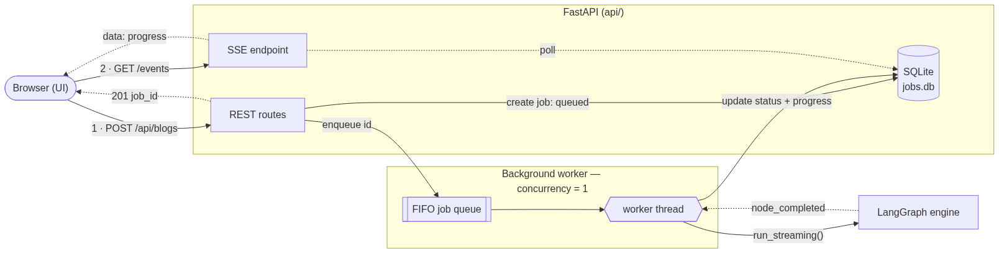
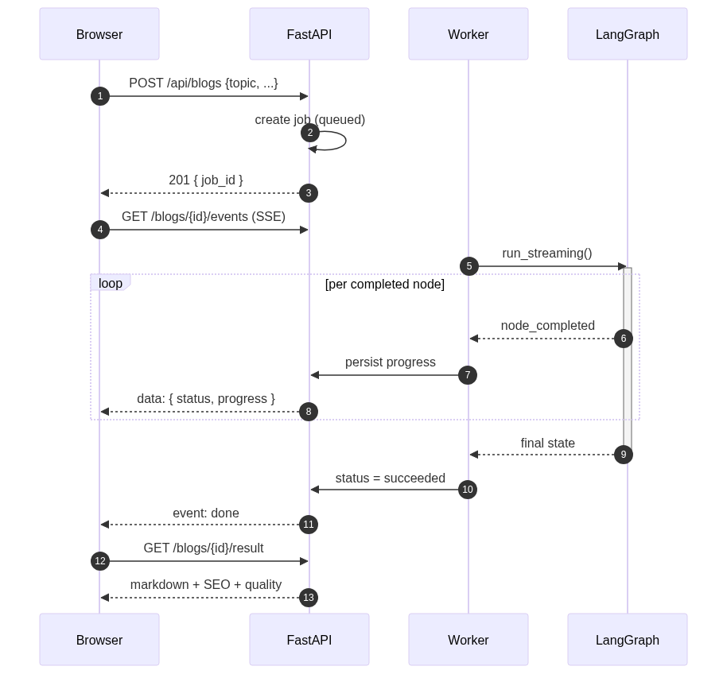
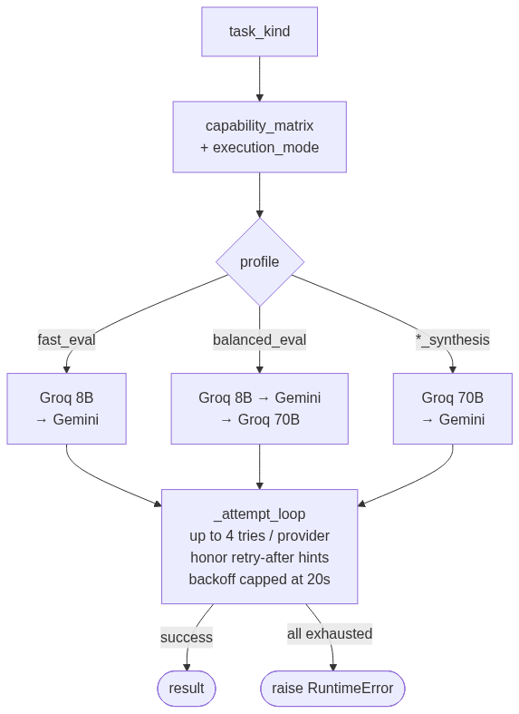

<div align="center">

# ✍️ Multi-Agent Research Article Writer

**A production-style, research-aware content pipeline that turns a single topic into a long-form, fact-checked, SEO-ready technical blog.**

Built on [LangGraph](https://langchain-ai.github.io/langgraph/) · served by [FastAPI](https://fastapi.tiangolo.com/) · driven by a zero-build vanilla web UI.

    

</div>

---

## Table of Contents

- [What it does](#what-it-does)
- [Highlights](#highlights)
- [Architecture at a glance](#architecture-at-a-glance)
- [The generation pipeline (LangGraph)](#the-generation-pipeline-langgraph)
- [Inside a section: write → verify → revise](#inside-a-section-write--verify--revise)
- [Backend: async jobs & streaming](#backend-async-jobs--streaming)
- [Request lifecycle](#request-lifecycle)
- [Model routing & rate-limit resilience](#model-routing--rate-limit-resilience)
- [Project structure](#project-structure)
- [Quick start](#quick-start)
- [Configuration](#configuration)
- [Usage](#usage)
- [REST API reference](#rest-api-reference)
- [Outputs & observability](#outputs--observability)
- [Performance & the rate-limit reality](#performance--the-rate-limit-reality)
- [Testing](#testing)
- [Troubleshooting](#troubleshooting)
- [Roadmap](#roadmap)

---

## What it does

Give it a topic. It will:

1. **Decide** whether the topic needs live web research.
2. **Research** with Tavily and normalize the evidence (when needed).
3. **Plan** a 7–9 section outline with a real narrative arc.
4. **Debate** the angle from optimist / critic / neutral personas.
5. **Write** each section in depth — with examples, code, numbers, and trade-offs.
6. **Fact-check** every external claim against the gathered evidence and **auto-revise** weak ones.
7. **Humanize** the merged draft so it doesn't read like a template.
8. **Generate SEO metadata** (title, description, slug, keywords, FAQ).
9. **Score quality** (clarity, depth, redundancy, hallucination risk, SEO readiness).
10. **Export** Markdown + metadata + a telemetry dashboard for every run.

The result is a long-form (**~3,500–5,000 word**) technical article with inline citations.

---

## Highlights

| Capability | Description |
|---|---|
| 🔎 **Research routing** | Classifies topics as `closed_book` / `hybrid` / `open_book` and only researches when it helps. |
| 🧱 **Structured planning** | 7–9 non-overlapping sections, narrative arc, mandatory coverage (code, edge cases, trade-offs, checklist). |
| 🎭 **Multi-persona reasoning** | Optimist, critic, and neutral perspectives synthesized into a writing brief. |
| 👥 **Audience adaptation** | `beginner` · `practitioner` · `engineer` · `researcher` · `executive` profiles change depth, tone, and code density. |
| ✅ **Fact-checking + auto-revision** | Per-section claim extraction, verification against allowed evidence, and rewrites for unsupported claims. |
| 🔗 **Inline citations** | Claims are linked to the evidence URLs that support them. |
| 🪄 **Humanization** | A final polish pass with a safety net that refuses to silently truncate the article. |
| 📈 **SEO + quality scoring** | Metadata generation and a 6-dimension quality rubric. |
| 🛰️ **Observability** | Per-node tracing, retry/fallback metrics, and an HTML dashboard per run. |
| 💸 **Cost/latency-aware routing** | Task-specific model profiles, provider fallback, and rate-limit backoff. |
| 🌐 **Full stack** | Async FastAPI backend with live SSE progress + a polished, dependency-free web UI. |

---

## Architecture at a glance

The `src/` engine is self-contained and provider-agnostic. The `api/` layer is a thin async wrapper; the `web/` UI talks only to the REST/SSE API. Any layer can be used independently (CLI, Python import, REST, or browser).

```text
   ┌────────────────────────────────────────────────────────────────┐
   │  BROWSER                                                       │
   │  Web UI  —  web/  (vanilla HTML / CSS / JS)                    │
   └────────────────────────────────────────────────────────────────┘
        │
        ▼   POST /api/blogs  ·  SSE progress stream
   ┌────────────────────────────────────────────────────────────────┐
   │  FASTAPI SERVER  —  api/                                       │
   │  REST + SSE routes  (api/main.py)                              │
   └────────────────────────────────────────────────────────────────┘
        │
        ▼   enqueue job
   ┌────────────────────────────────────────────────────────────────┐
   │  JobManager  —  single worker thread  (api/jobs.py)            │
   │  durable state  ⇄  SQLite  (outputs/jobs.db)                  │         
   └────────────────────────────────────────────────────────────────┘
        │
        ▼   run_streaming()
   ┌────────────────────────────────────────────────────────────────┐
   │  LANGGRAPH ENGINE  —  src/                                     │
   │  Blog pipeline (14 nodes)  →  LLM factory (routing + backoff)  │
   └────────────────────────────────────────────────────────────────┘
        │
        ▼   routed LLM / search calls
   ┌────────────────────────────────────────────────────────────────┐
   │  PROVIDERS                                                     │
   │  Groq  llama-3.3-70b / 8b-instant      → primary               │
   │  Gemini  2.5-flash                     → fallback              │
   │  Tavily                                → web research          │
   └────────────────────────────────────────────────────────────────┘
```

---

## The generation pipeline (LangGraph)

The heart of the system is a LangGraph `StateGraph` over a shared `BlogState`. Each node is wrapped with tracing and emits progress as it completes. The flow is a single spine with one conditional branch (research is skipped for evergreen topics).

```text
                       ┌─────────┐
                       │  START  │
                       └────┬────┘
                            ▼
      (1)  router .................. research decision + mode
                            │
                            ▼
      (2)  audience_adapter ........ depth / tone / code density
                            │
                    needs_research ?
                  ┌─────────┴──────────┐
                 yes                   no
                  ▼                    │
      (3)  research ...........        │   Tavily evidence
                  │                    │
                  └─────────┬──────────┘
                            ▼
      (4)  citation_enricher ....... build URL → source registry
                            │
                            ▼
      (5)  orchestrator ............ 7–9 section plan (validated)
                            │
                            ▼
      (6)  persona ................. optimist / critic / neutral
                            │
                            │   Send() fan-out: one branch per section
                            ▼
      (7)  worker_pipeline ......... write → fact-check → revise
                            │        (see "Inside a section" below)
                            │   reduce: merge section results
                            ▼
      (8)  reducer ................. merge sections in order
                            │
                            ▼
      (9)  humanizer ............... natural-language polish
                            │
                            ▼
     (10)  seo_optimizer .......... title, slug, keywords, FAQ
                            │
                            ▼
     (11)  image_pipeline ......... optional diagrams (clean fallback)
                            │
                            ▼
     (12)  quality_scoring ........ clarity, depth, redundancy, ...
                            │
                            ▼
     (13)  export ................. write .md + SEO + manifest
                            │
                            ▼
     (14)  dashboard ............. run log + HTML telemetry
                            │
                            ▼
                       ┌─────────┐
                       │   END   │
                       └─────────┘
```

> An auto-generated PNG of the same compiled graph is also available at [`docs/langgraph_pipeline.png`](docs/langgraph_pipeline.png) (produced by `app.get_graph().draw_mermaid_png()`).

| Stage | Node | Responsibility |
|---|---|---|
| 1 | `router` | Decide `closed_book` / `hybrid` / `open_book` and emit search queries. |
| 2 | `audience_adapter` | Turn an audience mode into concrete writing constraints. |
| 3 | `research` *(conditional)* | Tavily search → normalized, de-duplicated `EvidenceItem`s. |
| 4 | `citation_enricher` | Build a URL→source registry and map evidence to sections. |
| 5 | `orchestrator` | Produce the validated `Plan` (sections, goals, bullets, word targets). |
| 6 | `persona` | Generate three perspectives and synthesize a writing brief. |
| 7 | `worker_pipeline` | **Fan-out**: draft, fact-check, and revise each section in isolation. |
| 8 | `reducer` | Merge sections in order into one document. |
| 9 | `humanizer` | Final natural-language polish (with anti-truncation safety net). |
| 10 | `seo_optimizer` | SEO metadata. |
| 11 | `image_pipeline` | Optional diagrams; failures degrade cleanly (text is never polluted). |
| 12 | `quality_scoring` | Score clarity, depth, redundancy, hallucination risk, SEO readiness. |
| 13 | `export` | Persist Markdown + SEO JSON + artifact manifest. |
| 14 | `dashboard` | Write the run log and an HTML dashboard. |

---

## Inside a section: write → verify → revise

`persona` fans out one `Send` per planned section. Each section runs the same three-step sub-pipeline **independently**, then results are merged by a LangGraph reducer.

```text
   Plan (N sections)
        │   fan-out: one Send() per section
        ▼
┌─────────────────────────────────────────────────────────────────────────┐
│  worker_pipeline   —   runs independently for each section              │
│                                                                         │
│  ┌───────────────────┐    ┌──────────────────┐    ┌──────────────────┐  │
│  │ [1] worker_draft  │    │ [2] fact_checker │    │ [3] revision     │  │
│  │ write the section │    │ extract claims,  │    │ soften / rewrite │  │
│  │ to target length  │ ─► │ verify each vs   │ ─► │ + inject inline  │  │
│  │ (≤3 passes)       │    │ allowed evidence │    │ citations        │  │
│  └───────────────────┘    └──────────────────┘    └──────────────────┘  │
└─────────────────────────────────────────────────────────────────────────┘
        │   reduce: merge the section results in plan order
        ▼
   Merged article
```

Key guarantees:
- **Substantial sections.** The writer enforces ~90% of the target word count over up to 3 passes, expanding with *substance* (examples, code, numbers) rather than filler.
- **Cohesion.** Every writer sees the full outline, so sections don't overlap and read as one article.
- **Grounding.** Unsupported external claims are softened or removed; only allowed URLs are cited.

---

## Backend: async jobs & streaming

A single generation can take many minutes, so the API never blocks on it. Work is enqueued and executed by **one** background worker (concurrency of 1 is intentional — see [rate-limit reality](#performance--the-rate-limit-reality)).

<p align="center">
  
</p>

- **Durable state** lives in SQLite (`outputs/jobs.db`), so jobs survive a server restart; orphaned `running` jobs are reconciled to `failed` on boot.
- **Progress** is streamed node-by-node over Server-Sent Events, with a polling fallback if the stream drops.
- **Cancellation** is a DB flag polled between nodes (best-effort; the in-flight node finishes first).

---

## Request lifecycle

<p align="center">
  
</p>

---

## Model routing & rate-limit resilience

The system does **not** use one model for everything. Each task kind maps to a capability profile; profiles resolve to an **ordered provider list** with automatic fallback and rate-limit backoff.

<p align="center">
  
</p>

| Profile | Used for | Providers (in order) |
|---|---|---|
| `fast_eval` | router, research synth, diagram blueprint | Groq 8B → Gemini |
| `balanced_eval` | fact-check, SEO, quality scoring | Groq 8B → Gemini → Groq 70B |
| `balanced_synthesis` / `quality_synthesis` | planning, persona, **writing**, revision, humanizer | Groq 70B → Gemini |

- **Groq is primary**; Gemini is a fallback (its free tier is ~20 requests/day and is easily exhausted).
- **Backoff** parses provider hints (`"try again in Ns"`, `retryDelay`) and waits (capped) before retrying the same provider.
- **Serialized fan-out** (`max_concurrency=1`) keeps the pipeline under Groq's tokens-per-minute ceiling.

`execution_mode` biases the choice: `budget` → cheapest profile, `quality` → strongest, `balanced` → the middle.

---

## Project structure

```text
Blog_writing_agent/
├── api/                       # FastAPI backend (async job layer)
│   ├── db.py                  # SQLite job store + lifecycle
│   ├── jobs.py                # single-worker queue / JobManager
│   ├── main.py                # REST + SSE routes, static serving, CORS
│   └── schemas.py             # request/response models
├── web/                       # Frontend (no build step)
│   ├── index.html             # app shell + view templates
│   ├── styles.css             # design system
│   ├── app.js                 # router, form, SSE, results, history
│   └── markdown.js            # dependency-free, XSS-safe MD renderer
├── src/                       # LangGraph engine
│   ├── agents/                # one responsibility per agent (router, planner, …)
│   ├── graph/                 # state.py, main_graph.py, worker_graph.py, reducer_graph.py
│   ├── models/                # llm_factory, latency_optimizer, capability_matrix, model_config
│   ├── prompts/               # router / planner / writer / verification / scoring / seo
│   ├── observability/         # tracing, metrics, run_logger, dashboard
│   ├── outputs/               # artifact writers
│   ├── utils/                 # markdown, evidence, claim, retry, image helpers
│   └── main.py                # CLI entry point
├── outputs/runs/<run_id>/     # generated artifacts per run
├── tests/smoke_backend.py     # fake-engine job lifecycle test (no LLM)
├── requirements.txt                  
└── readme.md
```

---

## Quick start

**Prerequisites:** Python 3.11+, and at least one provider API key (Groq recommended; Tavily for research; Gemini optional).

```powershell
# 1. Install dependencies
pip install -r requirements.txt

# 2. Configure keys (create a .env file — see Configuration)
#    GROQ_API_KEY=...
#    TAVILY_API_KEY=...
#    GOOGLE_API_KEY=...      (optional fallback)

# 3a. Run the full app (API + web UI)
python -m uvicorn api.main:app --reload --port 8000
#     UI  -> http://localhost:8000/
#     API -> http://localhost:8000/docs

# 3b. ...or run a single blog from the CLI
python -m src.main
```

---

## Configuration

All configuration is via environment variables (loaded from `.env`).

### API keys

| Variable | Required | Purpose |
|---|---|---|
| `GROQ_API_KEY` | recommended | Primary text generation (Llama 3.3 70B / 3.1 8B). |
| `TAVILY_API_KEY` | for research | Web search evidence. |
| `GOOGLE_API_KEY` | optional | Gemini fallback + image generation. |

### Behavior

| Variable | Default | Purpose |
|---|---|---|
| `BLOG_EXECUTION_MODE` | `balanced` | `budget` · `balanced` · `quality`. |
| `BLOG_DEFAULT_AUDIENCE` | `engineer` | Default audience profile. |
| `BLOG_IMAGE_MODE` | `diagram` | `off` (text-only) · `diagram` (local) · `auto` · `direct`. |
| `BLOG_MAX_CONCURRENCY` | `1` | Section fan-out parallelism. Raise only if you have higher rate limits. |
| `BLOG_OUTPUT_DIR` | `./outputs` | Where runs and the job DB are written. |

### Model overrides

| Variable | Default |
|---|---|
| `BLOG_GROQ_MODEL` | `llama-3.3-70b-versatile` |
| `BLOG_FAST_GROQ_MODEL` | `llama-3.1-8b-instant` |
| `BLOG_GEMINI_MODEL` | `gemini-2.5-flash` |
| `BLOG_GEMINI_EVAL_MODEL` | = `BLOG_GEMINI_MODEL` |

---

## Usage

### Web UI

Open `http://localhost:8000/`. Four screens:

1. **New Blog** — enter a topic, pick audience / execution / image mode, submit.
2. **Generation** — live node-by-node timeline, elapsed timer, cancel. Deep-linkable (`#/job/{id}`) so a refresh reconnects to a running job.
3. **Result** — rendered Markdown with **SEO / Quality / Images** tabs, plus Download `.md`, Copy, and Dashboard links.
4. **History** — every run, click to reopen.

### Python

```python
from src.main import run

result = run(
    topic="Inside a Transformer: From Attention to Output Tokens",
    audience_mode="engineer",      # beginner | practitioner | engineer | researcher | executive
    execution_mode="balanced",     # budget | balanced | quality
    image_mode="off",              # off | diagram | auto | direct
)
print(result["output_path"])
```

### Streaming (programmatic progress)

```python
from src.graph.main_graph import run_streaming

def on_event(ev):
    print(ev)  # {"type": "node_completed", "node": "orchestrator"}, ...

final = run_streaming(topic="...", on_event=on_event, should_cancel=lambda: False)
```

---

## REST API reference

| Method | Path | Description |
|---|---|---|
| `GET` | `/api/health` | Liveness + queue depth. |
| `GET` | `/api/meta` | Dropdown options + pipeline node list. |
| `POST` | `/api/blogs` | Enqueue a job. Body: `{topic, audience_mode, execution_mode, image_mode, as_of?}`. Returns `201` + job detail. |
| `GET` | `/api/blogs` | List jobs (newest first). |
| `GET` | `/api/blogs/{id}` | Job detail + progress. |
| `GET` | `/api/blogs/{id}/events` | **SSE** progress stream. |
| `POST` | `/api/blogs/{id}/cancel` | Request cancellation (best-effort). |
| `GET` | `/api/blogs/{id}/result` | Final markdown + SEO + quality + image URLs. |
| `GET` | `/api/runs/{run_id}/markdown` | Raw Markdown. |
| `GET` | `/api/runs/{run_id}/dashboard` | HTML telemetry dashboard. |
| `GET` | `/api/runs/{run_id}/images/{file}` | A generated image. |

Interactive docs are available at `/docs` (Swagger) and `/redoc`.

```bash
# Start a job and watch progress
curl -X POST localhost:8000/api/blogs \
  -H "Content-Type: application/json" \
  -d '{"topic":"Retrieval-Augmented Generation in Production","audience_mode":"engineer","image_mode":"off"}'

curl -N localhost:8000/api/blogs/<id>/events     # live SSE stream
```

---

## Outputs & observability

Every run writes to `outputs/runs/<run_id>/`:

```text
outputs/runs/<run_id>/
├── <Blog Title>.md        # the article
├── seo_metadata.json      # title, description, slug, keywords, FAQ
├── run_log.json           # full telemetry (trace, retries, fallbacks, quality)
├── dashboard.html         # human-readable run dashboard
└── images/                # generated diagrams (if image mode != off)
```

The **dashboard** summarizes per-node timing, retries, provider fallbacks, the quality rubric, and the verification reports — useful for inspecting a run without reading raw JSON.

---

## Performance & the rate-limit reality

This is a **multi-agent** pipeline; a single article triggers dozens of LLM calls. Free provider tiers are the dominant constraint:

| Provider / model | Free-tier limit | Role |
|---|---|---|
| Groq `llama-3.3-70b` | ~12k tokens/min, ~100k/day | Primary writer/synthesis |
| Groq `llama-3.1-8b` | higher TPM | Evaluation tasks |
| Gemini `2.5-flash` | ~20 requests/day | Fallback only |

Consequences and mitigations:

- **Runs are paced, not parallel.** Expect several minutes (and on a constrained free tier, much longer). The single-worker queue + retry-after backoff trade speed for *reliability* — a run completes instead of collapsing.
- **Daily caps are an infra limit, not a bug.** If you see "tokens per day" errors, wait for the reset or upgrade the Groq tier.
- **To go faster:** set `BLOG_MAX_CONCURRENCY=3+` and/or use paid tiers, then the fan-out parallelizes.

---

## Testing

```powershell
# Backend job lifecycle (success / cancel / failure / restart) — uses a FAKE
# engine, so no LLM calls and no long waits.
python -m tests.smoke_backend
```

The smoke test injects a fast fake engine into the `JobManager`, proving the queue, SQLite store, progress tracking, cancellation, and restart-reconciliation independently of the LLM pipeline.

---

## Troubleshooting

| Symptom | Cause / fix |
|---|---|
| `No supported LLM credentials found` | Set `GROQ_API_KEY` (and/or `GOOGLE_API_KEY`) in `.env`. |
| Run is very slow / stalls | Free-tier rate limits. It's pacing with backoff — let it run, or upgrade the Groq tier. |
| `tokens per day` errors | Daily quota hit; wait for reset or upgrade. |
| No citations in the blog | Topic routed as `closed_book` (no research) or `TAVILY_API_KEY` missing. |
| Images missing | `BLOG_IMAGE_MODE=off`, or Gemini image quota exhausted (text is unaffected). |
| Backend unavailable in UI | Start `uvicorn api.main:app` and reload the page. |

---


<div align="center">

Built with LangGraph, FastAPI, Groq, Gemini, and Tavily.


</div>
